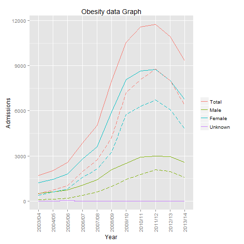

Exploring Obesity ShinyApp
========================================================
author: P Skelton
date: Sat Nov 21 20:13:40 2015

Introduction
========================================================
This small app allows you to look at a few features of obesity trends in the UK.
The data set is published by the Health and Social Care Information Centre under
an Open Government License. It can be found here:
- https://data.gov.uk/dataset/statistics_on_obesity_physical_activity_and_diet_england

The app can be found online at:
- https://pskelton.shinyapps.io/project

Features
========================================================

The app has three main sections
- About: An about pages disaplying some useful information about the app and a breif user guide
- Graphs: Interactively drawn graphs for visual comparison of the different sets of data
- Data: Data tables of the data sets which can be searched and ordered for numeric comparison

Example
========================================================
This is an example of one of the graphs the app can produce interactively. Here we can see the high correlation between the number of primary obesity admissions and bariatric surgery admissions.

 

Uses
========================================================
- Online simple product so can be accessed anywhere
- Useful for quick reference
- Can be used for compelling visual comparison
- Can identify at risk gender / age groups to target response

The data file also contains many location statistics. Improving the app to display this graphically could help highlight any regional variations.
